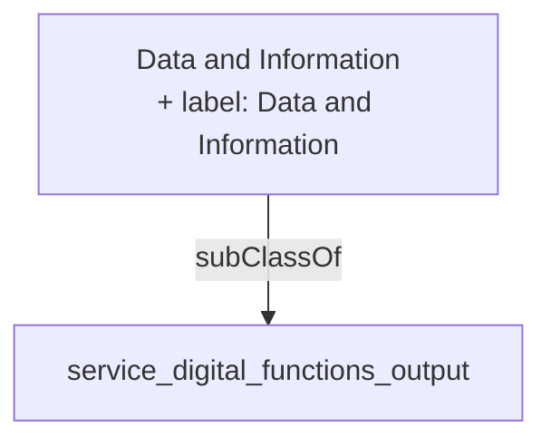

## Semantic Connections

```mermaid
graph TD
  Data_and_Information["Data and Information<br>+ label: Data and Information"]:::current-page-node
  service_digital_functions_output["service_digital_functions_output"]
  Data_and_Information-->|" subClassOf "|service_digital_functions_output
```
