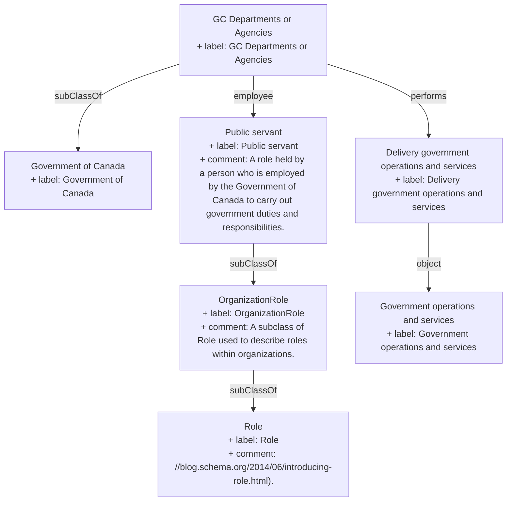

## Related Links

- [[OrganizationRole]]
- [[Role]]
- [[deliver_government_operations_services]]
- [[government]]
- [[government_operations_services]]
- [[public_servant]]

## Semantic Connections

