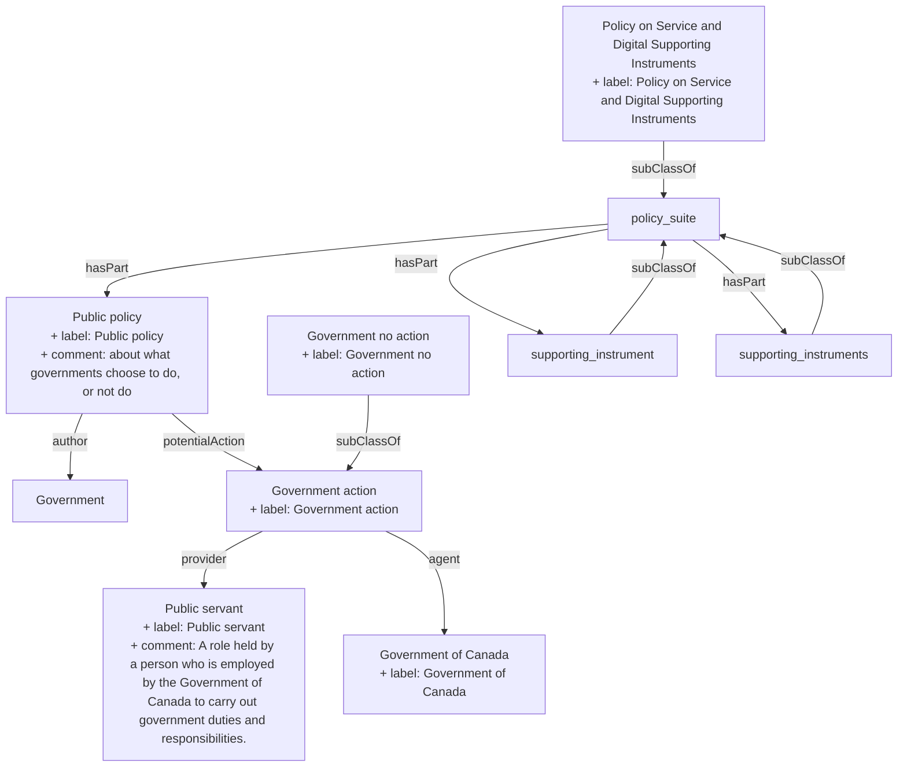

## Related Links

- [[government_action]]
- [[government_no_action]]
- [[policy]]
- [[public_servant]]

## Semantic Connections

```mermaid
graph TD
  Government["Government"]:::current-page-node
  Public_policy["Public policy<br>+ label: Public policy<br>+ comment: about what governments choose to do, or not do"]
  Government_action["Government action<br>+ label: Government action"]
  policy_suite["policy_suite"]
  Government_of_Canada["Government of Canada<br>+ label: Government of Canada"]
  Public_servant["Public servant<br>+ label: Public servant<br>+ comment: A role held by a person who is employed by the Government of Canada to carry out government duties and responsibilities."]
  Government_no_action["Government no action<br>+ label: Government no action"]
  supporting_instrument["supporting_instrument"]
  supporting_instruments["supporting_instruments"]
  Policy_on_Service_and_Digital_Supporting_Instruments["Policy on Service and Digital Supporting Instruments<br>+ label: Policy on Service and Digital Supporting Instruments"]
  Policy_on_Service_and_Digital_Supporting_Instruments-->|" subClassOf "|policy_suite
  Public_policy-->|" author "|Government
  supporting_instruments-->|" subClassOf "|policy_suite
  policy_suite-->|" hasPart "|Public_policy
  supporting_instrument-->|" subClassOf "|policy_suite
  Public_policy-->|" potentialAction "|Government_action
  policy_suite-->|" hasPart "|supporting_instrument
  Government_action-->|" provider "|Public_servant
  Government_no_action-->|" subClassOf "|Government_action
  Government_action-->|" agent "|Government_of_Canada
  policy_suite-->|" hasPart "|supporting_instruments
```
