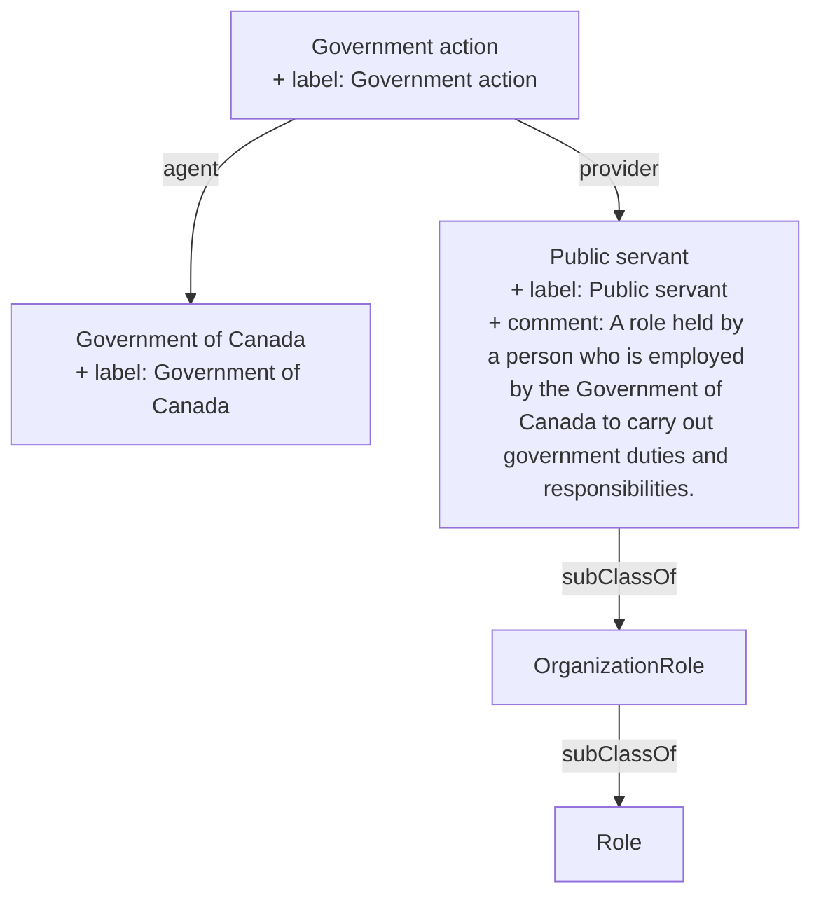

## Related Links

- [[OrganizationRole]]
- [[Role]]
- [[government]]
- [[government_action]]
- [[public_servant]]

## Semantic Connections

```mermaid
graph TD
  Government_action["Government action<br>+ label: Government action"]:::current-page-node
  Government_of_Canada["Government of Canada<br>+ label: Government of Canada"]
  Public_servant["Public servant<br>+ label: Public servant<br>+ comment: A role held by a person who is employed by the Government of Canada to carry out government duties and responsibilities."]
  OrganizationRole["OrganizationRole"]
  Role["Role"]
  Public_servant-->|" subClassOf "|OrganizationRole
  Government_action-->|" agent "|Government_of_Canada
  Government_action-->|" provider "|Public_servant
  OrganizationRole-->|" subClassOf "|Role
```
