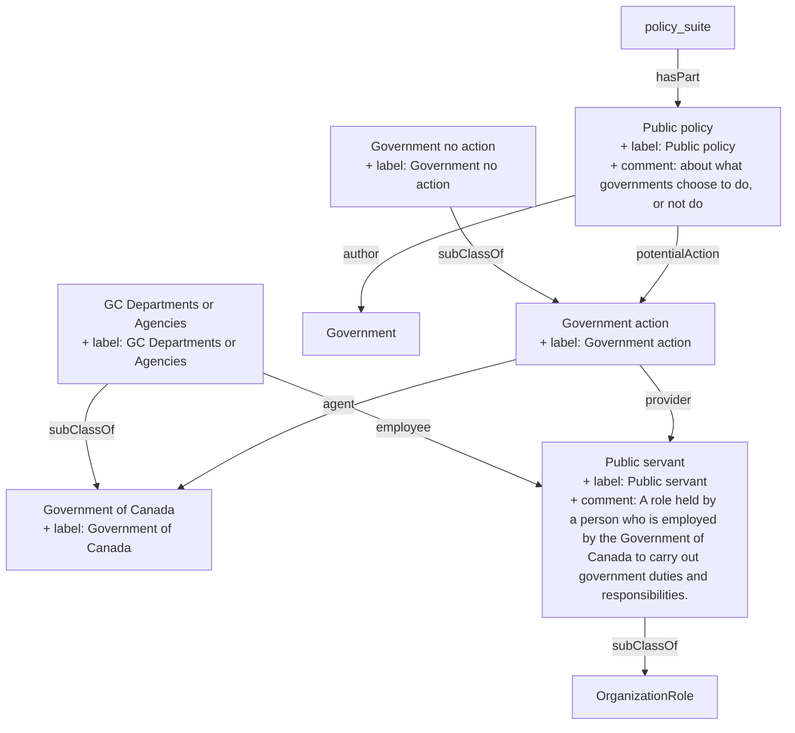

## Related Links

- [[Government]]
- [[OrganizationRole]]
- [[department_agency_ca]]
- [[government]]
- [[government_action]]
- [[government_no_action]]
- [[policy]]
- [[public_servant]]

## Semantic Connections

