## Related Links

- [[advances_government_operations_services]]
- [[cyber_security]]
- [[data_information]]
- [[deliver_government_operations_services]]
- [[department_agency_ca]]
- [[government]]
- [[government_operations_services]]
- [[information_technology]]
- [[manages_cyber_security]]
- [[manages_data_information]]
- [[manages_data_information_strategic]]
- [[manages_information_technology]]
- [[manages_service_delivery]]
- [[operation]]
- [[policy_service_digital]]
- [[policy_service_digital_8]]
- [[product]]
- [[public_servant]]
- [[service]]
- [[service_delivery]]
- [[service_digital_functions]]
- [[service_digital_suite]]
- [[user]]

## Semantic Connections

```mermaid
graph TD
  Manages_service_and_digital_functions["Manages service and digital functions<br>+ label: Manages service and digital functions"]:::current-page-node
  Delivery_government_operations_and_services["Delivery government operations and services<br>+ label: Delivery government operations and services"]
  Service_and_digital_functions["Service and digital functions<br>+ label: Service and digital functions"]
  Manages_service_delivery["Manages service delivery<br>+ label: Manages service delivery"]
  Manages_data_and_information["Manages data and information<br>+ label: Manages data and information"]
  Manages_information_technology["Manages information technology<br>+ label: Manages information technology"]
  Manages_cyber_security["Manages cyber security<br>+ label: Manages cyber security"]
  Data_and_Information["Data and Information<br>+ label: Data and Information"]
  strategic_management_of_data_and_information["strategic management of data and information<br>+ label: strategic management of data and information"]
  Service_delivery["Service delivery<br>+ label: Service delivery"]
  Information_Technology["Information Technology<br>+ label: Information Technology"]
  Government_operations_and_services["Government operations and services<br>+ label: Government operations and services"]
  GC_Departments_or_Agencies["GC Departments or Agencies<br>+ label: GC Departments or Agencies"]
  Cyber_Security["Cyber Security<br>+ label: Cyber Security"]
  Policy_on_Service_and_Digital["Policy on Service and Digital<br>+ label: Policy on Service and Digital<br>+ comment: The Policy on Service and Digital defines how a Government Department Agency manages service and digital functions. "]
  chief_digital_service_officer["chief_digital_service_officer"]
  data_information_functions["data_information_functions"]
  User["User<br>+ label: User"]
  Advances_government_operations_and_services["Advances government operations and services<br>+ label: Advances government operations and services"]
  Service["Service<br>+ label: Service"]
  Product["Product<br>+ label: Product"]
  Operation["Operation<br>+ label: Operation"]
  data_information_functions_stakeholder["data_information_functions_stakeholder"]
  data_information_functions_business_line["data_information_functions_business_line"]
  chief_data_office["chief_data_office"]
  leads_data_information_functions["leads_data_information_functions"]
  is_strategic["is_strategic"]
  service_digital_functions_output["service_digital_functions_output"]
  cdso_accountabilities["cdso_accountabilities"]
  deputy_head["deputy_head"]
  Chief_Data_Officer["Chief Data Officer<br>+ label: Chief Data Officer"]
  Chief_Technology_Officer["Chief Technology Officer<br>+ label: Chief Technology Officer"]
  Policy_on_Service_and_Digital_Supporting_Instruments["Policy on Service and Digital Supporting Instruments<br>+ label: Policy on Service and Digital Supporting Instruments"]
  privacy_requirements["privacy_requirements"]
  official_languages_requirements["official_languages_requirements"]
  accessibility_requirements["accessibility_requirements"]
  digital_era["digital_era"]
  doc_engaspx["doc-eng.aspx"]
  service_digital_suite["service_digital_suite"]
  Section_8___References___Policy_on_Service_and_Digital["Section 8 - References - Policy on Service and Digital<br>+ label: Section 8 - References - Policy on Service and Digital"]
  Government_of_Canada["Government of Canada<br>+ label: Government of Canada"]
  Public_servant["Public servant<br>+ label: Public servant<br>+ comment: A role held by a person who is employed by the Government of Canada to carry out government duties and responsibilities."]
  Manages_cyber_security-->|" subClassOf "|Manages_service_and_digital_functions
  Manages_service_delivery-->|" subClassOf "|Manages_service_and_digital_functions
  Chief_Technology_Officer-->|" reports_to "|chief_digital_service_officer
  Manages_data_and_information-->|" subClassOf "|Manages_service_and_digital_functions
  data_information_functions-->|" subClassOf "|Service_and_digital_functions
  Chief_Data_Officer-->|" reports_to "|chief_digital_service_officer
  strategic_management_of_data_and_information-->|" hasPart "|Manages_data_and_information
  chief_digital_service_officer-->|" partOf "|Service_and_digital_functions
  Service_delivery-->|" subClassOf "|Service_and_digital_functions
  Section_8___References___Policy_on_Service_and_Digital-->|" subClassOf "|Policy_on_Service_and_Digital
  Manages_cyber_security-->|" object "|Cyber_Security
  leads_data_information_functions-->|" provider "|data_information_functions
  Policy_on_Service_and_Digital-->|" in_conjunction_with "|privacy_requirements
  chief_data_office-->|" provides "|data_information_functions
  Manages_service_and_digital_functions-->|" subClassOf "|Delivery_government_operations_and_services
  Policy_on_Service_and_Digital-->|" provider "|GC_Departments_or_Agencies
  Manages_service_and_digital_functions-->|" object "|Service_and_digital_functions
  Policy_on_Service_and_Digital-->|" seeAlso "|doc_engaspx
  GC_Departments_or_Agencies-->|" subClassOf "|Government_of_Canada
  Product-->|" subClassOf "|Government_operations_and_services
  Policy_on_Service_and_Digital_Supporting_Instruments-->|" supports "|Policy_on_Service_and_Digital
  Manages_information_technology-->|" object "|Information_Technology
  service_digital_suite-->|" hasPart "|Policy_on_Service_and_Digital
  Policy_on_Service_and_Digital-->|" object "|Service_and_digital_functions
  Advances_government_operations_and_services-->|" object "|Government_operations_and_services
  Policy_on_Service_and_Digital-->|" has_context "|digital_era
  Manages_service_delivery-->|" object "|Service_delivery
  User-->|" interacts_with "|Information_Technology
  Data_and_Information-->|" subClassOf "|service_digital_functions_output
  Policy_on_Service_and_Digital-->|" supportedBy "|Policy_on_Service_and_Digital_Supporting_Instruments
  Information_Technology-->|" subClassOf "|Service_and_digital_functions
  strategic_management_of_data_and_information-->|" hasPart "|is_strategic
  GC_Departments_or_Agencies-->|" employee "|Public_servant
  Section_8___References___Policy_on_Service_and_Digital-->|" source "|Policy_on_Service_and_Digital
  Delivery_government_operations_and_services-->|" object "|Government_operations_and_services
  Cyber_Security-->|" subClassOf "|Service_and_digital_functions
  Service-->|" subClassOf "|Government_operations_and_services
  chief_digital_service_officer-->|" has_accountabilities "|cdso_accountabilities
  Policy_on_Service_and_Digital-->|" in_conjunction_with "|official_languages_requirements
  data_information_functions-->|" reports_to "|chief_data_office
  chief_digital_service_officer-->|" reports_to "|deputy_head
  Manages_information_technology-->|" subClassOf "|Manages_service_and_digital_functions
  strategic_management_of_data_and_information-->|" subClassOf "|Advances_government_operations_and_services
  data_information_functions-->|" hasPart "|data_information_functions_stakeholder
  data_information_functions-->|" hasPart "|data_information_functions_business_line
  Policy_on_Service_and_Digital-->|" in_conjunction_with "|accessibility_requirements
  GC_Departments_or_Agencies-->|" performs "|Delivery_government_operations_and_services
  Service_and_digital_functions-->|" subClassOf "|Government_operations_and_services
  Operation-->|" subClassOf "|Government_operations_and_services
  Manages_data_and_information-->|" object "|Data_and_Information
  Policy_on_Service_and_Digital-->|" result "|Advances_government_operations_and_services
```

