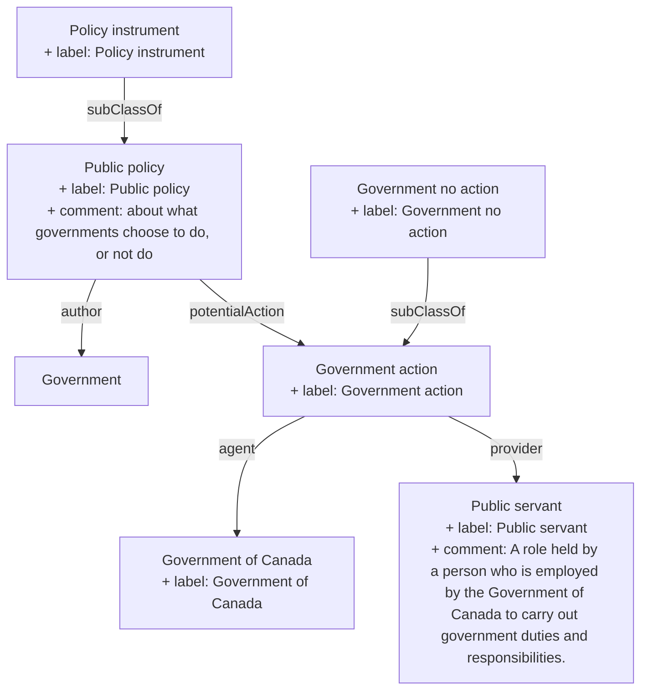

## Related Links

- [[Government]]
- [[government]]
- [[government_action]]
- [[government_no_action]]
- [[policy]]
- [[public_servant]]

## Semantic Connections

```mermaid
graph TD
  Policy_instrument["Policy instrument<br>+ label: Policy instrument"]:::current-page-node
  Public_policy["Public policy<br>+ label: Public policy<br>+ comment: about what governments choose to do, or not do"]
  Government["Government"]
  Government_action["Government action<br>+ label: Government action"]
  Government_of_Canada["Government of Canada<br>+ label: Government of Canada"]
  Public_servant["Public servant<br>+ label: Public servant<br>+ comment: A role held by a person who is employed by the Government of Canada to carry out government duties and responsibilities."]
  Government_no_action["Government no action<br>+ label: Government no action"]
  Government_no_action-->|" subClassOf "|Government_action
  Government_action-->|" agent "|Government_of_Canada
  Policy_instrument-->|" subClassOf "|Public_policy
  Public_policy-->|" author "|Government
  Public_policy-->|" potentialAction "|Government_action
  Government_action-->|" provider "|Public_servant
```
