## Related Links

- [[directive_on_charging_and_special_financial_authorities]]
- [[directive_on_the_management_of_projects_and_programmes]]
- [[foundation_framework_for_treasury_board_policies]]
- [[policy_on_access_to_information]]
- [[policy_on_communications_and_federal_identity]]
- [[policy_on_government_security]]
- [[policy_on_green_procurement]]
- [[policy_on_official_languages]]
- [[policy_on_privacy_protection]]
- [[policy_on_results]]
- [[policy_on_the_duty_to_accommodate]]
- [[policy_on_the_planning_and_management_of_investments]]
- [[policy_service_digital]]
- [[policy_service_digital_8]]
- [[policy_service_digital_8_1]]
- [[policy_service_digital_8_2]]
- [[values_and_ethics_code_for_the_public_sector]]

## Semantic Connections

```mermaid
graph TD
  Policy_on_Transfer_Payments["Policy on Transfer Payments<br>+ label: Policy on Transfer Payments"]:::current-page-node
  doc_engaspx["doc-eng.aspx"]
  Related_policy_instruments["Related policy instruments<br>+ label: Related policy instruments"]
  Section_8___References___Policy_on_Service_and_Digital["Section 8 - References - Policy on Service and Digital<br>+ label: Section 8 - References - Policy on Service and Digital"]
  Foundation_Framework_for_Treasury_Board_Policies["Foundation Framework for Treasury Board Policies<br>+ label: Foundation Framework for Treasury Board Policies"]
  Policy_on_Access_to_Information["Policy on Access to Information<br>+ label: Policy on Access to Information"]
  Policy_on_Communications_and_Federal_Identity["Policy on Communications and Federal Identity<br>+ label: Policy on Communications and Federal Identity"]
  Policy_on_Green_Procurement["Policy on Green Procurement<br>+ label: Policy on Green Procurement"]
  Policy_on_Government_Security["Policy on Government Security<br>+ label: Policy on Government Security"]
  Policy_on_the_Planning_and_Management_of_Investments["Policy on the Planning and Management of Investments<br>+ label: Policy on the Planning and Management of Investments"]
  Policy_on_Official_Languages["Policy on Official Languages<br>+ label: Policy on Official Languages"]
  Policy_on_Privacy_Protection["Policy on Privacy Protection<br>+ label: Policy on Privacy Protection"]
  Policy_on_Results["Policy on Results<br>+ label: Policy on Results"]
  Policy_on_the_Duty_to_Accommodate_Persons_with_Disabilities_in_the_Federal_Public_Service["Policy on the Duty to Accommodate Persons with Disabilities in the Federal Public Service<br>+ label: Policy on the Duty to Accommodate Persons with Disabilities in the Federal Public Service"]
  Values_and_Ethics_Code_for_the_Public_Sector["Values and Ethics Code for the Public Sector<br>+ label: Values and Ethics Code for the Public Sector"]
  Directive_on_the_Management_of_Projects_and_Programmes["Directive on the Management of Projects and Programmes<br>+ label: Directive on the Management of Projects and Programmes"]
  Directive_on_Charging_and_Special_Financial_Authorities["Directive on Charging and Special Financial Authorities<br>+ label: Directive on Charging and Special Financial Authorities"]
  doc_engaspx_1["doc-eng.aspx"]
  doc_engaspx_2["doc-eng.aspx"]
  doc_engaspx_3["doc-eng.aspx"]
  doc_engaspx_4["doc-eng.aspx"]
  doc_engaspx_5["doc-eng.aspx"]
  doc_engaspx_6["doc-eng.aspx"]
  doc_engaspx_7["doc-eng.aspx"]
  doc_engaspx_8["doc-eng.aspx"]
  doc_engaspx_9["doc-eng.aspx"]
  doc_engaspx_10["doc-eng.aspx"]
  index_engasp["index-eng.asp"]
  doc_engaspx_11["doc-eng.aspx"]
  doc_engaspx_12["doc-eng.aspx"]
  Policy_on_Service_and_Digital["Policy on Service and Digital<br>+ label: Policy on Service and Digital<br>+ comment: The Policy on Service and Digital defines how a Government Department Agency manages service and digital functions. "]
  Reference_legislations["Reference legislations<br>+ label: Reference legislations"]
  Related_policy_instruments-->|" hasPart "|Policy_on_Results
  Related_policy_instruments-->|" hasPart "|Policy_on_Communications_and_Federal_Identity
  Related_policy_instruments-->|" hasPart "|Policy_on_Privacy_Protection
  Policy_on_the_Planning_and_Management_of_Investments-->|" isReferencedBy "|doc_engaspx_1
  Directive_on_the_Management_of_Projects_and_Programmes-->|" isReferencedBy "|doc_engaspx_7
  Section_8___References___Policy_on_Service_and_Digital-->|" subClassOf "|Policy_on_Service_and_Digital
  Related_policy_instruments-->|" hasPart "|Values_and_Ethics_Code_for_the_Public_Sector
  Related_policy_instruments-->|" hasPart "|Directive_on_the_Management_of_Projects_and_Programmes
  Policy_on_Access_to_Information-->|" isReferencedBy "|doc_engaspx_12
  Policy_on_Privacy_Protection-->|" isReferencedBy "|doc_engaspx_8
  Policy_on_Green_Procurement-->|" isReferencedBy "|doc_engaspx_2
  Related_policy_instruments-->|" hasPart "|Policy_on_Government_Security
  Related_policy_instruments-->|" hasPart "|Policy_on_the_Planning_and_Management_of_Investments
  Policy_on_the_Duty_to_Accommodate_Persons_with_Disabilities_in_the_Federal_Public_Service-->|" isReferencedBy "|index_engasp
  Related_policy_instruments-->|" hasPart "|Policy_on_Official_Languages
  Foundation_Framework_for_Treasury_Board_Policies-->|" isReferencedBy "|doc_engaspx_10
  Reference_legislations-->|" source "|Section_8___References___Policy_on_Service_and_Digital
  Policy_on_Government_Security-->|" isReferencedBy "|doc_engaspx_11
  Related_policy_instruments-->|" hasPart "|Policy_on_Access_to_Information
  Section_8___References___Policy_on_Service_and_Digital-->|" source "|Policy_on_Service_and_Digital
  Policy_on_Official_Languages-->|" isReferencedBy "|doc_engaspx_6
  Related_policy_instruments-->|" hasPart "|Policy_on_the_Duty_to_Accommodate_Persons_with_Disabilities_in_the_Federal_Public_Service
  Policy_on_Results-->|" isReferencedBy "|doc_engaspx_3
  Related_policy_instruments-->|" hasPart "|Policy_on_Transfer_Payments
  Related_policy_instruments-->|" hasPart "|Foundation_Framework_for_Treasury_Board_Policies
  Related_policy_instruments-->|" source "|Section_8___References___Policy_on_Service_and_Digital
  Policy_on_Transfer_Payments-->|" isReferencedBy "|doc_engaspx
  Related_policy_instruments-->|" hasPart "|Directive_on_Charging_and_Special_Financial_Authorities
  Directive_on_Charging_and_Special_Financial_Authorities-->|" isReferencedBy "|doc_engaspx_5
  Related_policy_instruments-->|" hasPart "|Policy_on_Green_Procurement
  Policy_on_Communications_and_Federal_Identity-->|" isReferencedBy "|doc_engaspx_4
  Values_and_Ethics_Code_for_the_Public_Sector-->|" isReferencedBy "|doc_engaspx_9
```

