## Related Links

- [[access_to_information_act]]
- [[advances_government_operations_services]]
- [[canada_evidence_act]]
- [[department_agency_ca]]
- [[department_of_justice_act]]
- [[directive_on_charging_and_special_financial_authorities]]
- [[directive_on_the_management_of_projects_and_programmes]]
- [[emergency_management_act]]
- [[financial_administration_act]]
- [[foundation_framework_for_treasury_board_policies]]
- [[library_and_archives_of_canada_act]]
- [[official_languages_act]]
- [[personal_information_protection_and_electronic_documents_act]]
- [[policy_on_access_to_information]]
- [[policy_on_communications_and_federal_identity]]
- [[policy_on_government_security]]
- [[policy_on_green_procurement]]
- [[policy_on_official_languages]]
- [[policy_on_privacy_protection]]
- [[policy_on_results]]
- [[policy_on_the_duty_to_accommodate]]
- [[policy_on_the_planning_and_management_of_investments]]
- [[policy_on_transfer_payments]]
- [[policy_service_digital]]
- [[policy_service_digital_8_1]]
- [[policy_service_digital_8_2]]
- [[privacy_act]]
- [[public_service_employment_act]]
- [[security_of_information_act]]
- [[service_digital_functions]]
- [[service_digital_suite]]
- [[service_digital_supporting_instruments]]
- [[service_fees_act]]
- [[shared_services_canada_act]]
- [[statistics_act]]
- [[values_and_ethics_code_for_the_public_sector]]

## Semantic Connections

```mermaid
graph TD
  Section_8___References___Policy_on_Service_and_Digital["Section 8 - References - Policy on Service and Digital<br>+ label: Section 8 - References - Policy on Service and Digital"]:::current-page-node
  Policy_on_Service_and_Digital["Policy on Service and Digital<br>+ label: Policy on Service and Digital<br>+ comment: The Policy on Service and Digital defines how a Government Department Agency manages service and digital functions. "]
  Reference_legislations["Reference legislations<br>+ label: Reference legislations"]
  Related_policy_instruments["Related policy instruments<br>+ label: Related policy instruments"]
  Policy_on_Service_and_Digital_Supporting_Instruments["Policy on Service and Digital Supporting Instruments<br>+ label: Policy on Service and Digital Supporting Instruments"]
  privacy_requirements["privacy_requirements"]
  official_languages_requirements["official_languages_requirements"]
  accessibility_requirements["accessibility_requirements"]
  Service_and_digital_functions["Service and digital functions<br>+ label: Service and digital functions"]
  GC_Departments_or_Agencies["GC Departments or Agencies<br>+ label: GC Departments or Agencies"]
  Advances_government_operations_and_services["Advances government operations and services<br>+ label: Advances government operations and services"]
  digital_era["digital_era"]
  doc_engaspx["doc-eng.aspx"]
  service_digital_suite["service_digital_suite"]
  Foundation_Framework_for_Treasury_Board_Policies["Foundation Framework for Treasury Board Policies<br>+ label: Foundation Framework for Treasury Board Policies"]
  Policy_on_Access_to_Information["Policy on Access to Information<br>+ label: Policy on Access to Information"]
  Policy_on_Communications_and_Federal_Identity["Policy on Communications and Federal Identity<br>+ label: Policy on Communications and Federal Identity"]
  Policy_on_Green_Procurement["Policy on Green Procurement<br>+ label: Policy on Green Procurement"]
  Policy_on_Government_Security["Policy on Government Security<br>+ label: Policy on Government Security"]
  Policy_on_the_Planning_and_Management_of_Investments["Policy on the Planning and Management of Investments<br>+ label: Policy on the Planning and Management of Investments"]
  Policy_on_Official_Languages["Policy on Official Languages<br>+ label: Policy on Official Languages"]
  Policy_on_Privacy_Protection["Policy on Privacy Protection<br>+ label: Policy on Privacy Protection"]
  Policy_on_Results["Policy on Results<br>+ label: Policy on Results"]
  Policy_on_the_Duty_to_Accommodate_Persons_with_Disabilities_in_the_Federal_Public_Service["Policy on the Duty to Accommodate Persons with Disabilities in the Federal Public Service<br>+ label: Policy on the Duty to Accommodate Persons with Disabilities in the Federal Public Service"]
  Policy_on_Transfer_Payments["Policy on Transfer Payments<br>+ label: Policy on Transfer Payments"]
  Values_and_Ethics_Code_for_the_Public_Sector["Values and Ethics Code for the Public Sector<br>+ label: Values and Ethics Code for the Public Sector"]
  Directive_on_the_Management_of_Projects_and_Programmes["Directive on the Management of Projects and Programmes<br>+ label: Directive on the Management of Projects and Programmes"]
  Directive_on_Charging_and_Special_Financial_Authorities["Directive on Charging and Special Financial Authorities<br>+ label: Directive on Charging and Special Financial Authorities"]
  Access_to_Information_Act["Access to Information Act<br>+ label: Access to Information Act"]
  Canada_Evidence_Act["Canada Evidence Act<br>+ label: Canada Evidence Act"]
  Department_of_Justice_Act["Department of Justice Act<br>+ label: Department of Justice Act"]
  Emergency_Management_Act["Emergency Management Act<br>+ label: Emergency Management Act"]
  Financial_Administration_Act["Financial Administration Act<br>+ label: Financial Administration Act"]
  Library_and_Archives_of_Canada_Act["Library and Archives of Canada Act<br>+ label: Library and Archives of Canada Act"]
  Official_Languages_Act["Official Languages Act<br>+ label: Official Languages Act"]
  Personal_Information_Protection_and_Electronic_Documents_Act_Part_2["Personal Information Protection and Electronic Documents Act Part 2<br>+ label: Personal Information Protection and Electronic Documents Act (Part 2)"]
  Privacy_Act["Privacy Act<br>+ label: Privacy Act"]
  Public_Service_Employment_Act["Public Service Employment Act<br>+ label: Public Service Employment Act"]
  Security_of_Information_Act["Security of Information Act<br>+ label: Security of Information Act"]
  Service_Fees_Act["Service Fees Act<br>+ label: Service Fees Act"]
  Shared_Services_Canada_Act["Shared Services Canada Act<br>+ label: Shared Services Canada Act"]
  Statistics_Act["Statistics Act<br>+ label: Statistics Act"]
  Related_policy_instruments-->|" hasPart "|Policy_on_Communications_and_Federal_Identity
  Related_policy_instruments-->|" hasPart "|Policy_on_Access_to_Information
  Related_policy_instruments-->|" hasPart "|Policy_on_Privacy_Protection
  Reference_legislations-->|" hasPart "|Shared_Services_Canada_Act
  Related_policy_instruments-->|" hasPart "|Policy_on_Government_Security
  Related_policy_instruments-->|" hasPart "|Policy_on_the_Planning_and_Management_of_Investments
  Policy_on_Service_and_Digital-->|" result "|Advances_government_operations_and_services
  Policy_on_Service_and_Digital-->|" object "|Service_and_digital_functions
  Policy_on_Service_and_Digital-->|" supportedBy "|Policy_on_Service_and_Digital_Supporting_Instruments
  Related_policy_instruments-->|" hasPart "|Policy_on_Results
  Related_policy_instruments-->|" hasPart "|Policy_on_Green_Procurement
  Policy_on_Service_and_Digital-->|" provider "|GC_Departments_or_Agencies
  service_digital_suite-->|" hasPart "|Policy_on_Service_and_Digital
  Section_8___References___Policy_on_Service_and_Digital-->|" source "|Policy_on_Service_and_Digital
  Reference_legislations-->|" hasPart "|Canada_Evidence_Act
  Reference_legislations-->|" hasPart "|Library_and_Archives_of_Canada_Act
  Related_policy_instruments-->|" hasPart "|Values_and_Ethics_Code_for_the_Public_Sector
  Related_policy_instruments-->|" hasPart "|Directive_on_the_Management_of_Projects_and_Programmes
  Related_policy_instruments-->|" hasPart "|Directive_on_Charging_and_Special_Financial_Authorities
  Reference_legislations-->|" hasPart "|Department_of_Justice_Act
  Reference_legislations-->|" hasPart "|Access_to_Information_Act
  Reference_legislations-->|" hasPart "|Financial_Administration_Act
  Reference_legislations-->|" hasPart "|Service_Fees_Act
  Policy_on_Service_and_Digital-->|" in_conjunction_with "|privacy_requirements
  Related_policy_instruments-->|" hasPart "|Foundation_Framework_for_Treasury_Board_Policies
  Related_policy_instruments-->|" hasPart "|Policy_on_Official_Languages
  Policy_on_Service_and_Digital-->|" in_conjunction_with "|official_languages_requirements
  Related_policy_instruments-->|" source "|Section_8___References___Policy_on_Service_and_Digital
  Section_8___References___Policy_on_Service_and_Digital-->|" subClassOf "|Policy_on_Service_and_Digital
  Reference_legislations-->|" hasPart "|Emergency_Management_Act
  Related_policy_instruments-->|" hasPart "|Policy_on_the_Duty_to_Accommodate_Persons_with_Disabilities_in_the_Federal_Public_Service
  Reference_legislations-->|" hasPart "|Public_Service_Employment_Act
  Reference_legislations-->|" hasPart "|Security_of_Information_Act
  Policy_on_Service_and_Digital-->|" has_context "|digital_era
  Policy_on_Service_and_Digital-->|" seeAlso "|doc_engaspx
  Policy_on_Service_and_Digital_Supporting_Instruments-->|" supports "|Policy_on_Service_and_Digital
  Policy_on_Service_and_Digital-->|" in_conjunction_with "|accessibility_requirements
  Reference_legislations-->|" hasPart "|Privacy_Act
  Reference_legislations-->|" hasPart "|Personal_Information_Protection_and_Electronic_Documents_Act_Part_2
  Reference_legislations-->|" hasPart "|Statistics_Act
  Reference_legislations-->|" hasPart "|Official_Languages_Act
  Reference_legislations-->|" source "|Section_8___References___Policy_on_Service_and_Digital
  Related_policy_instruments-->|" hasPart "|Policy_on_Transfer_Payments
```

