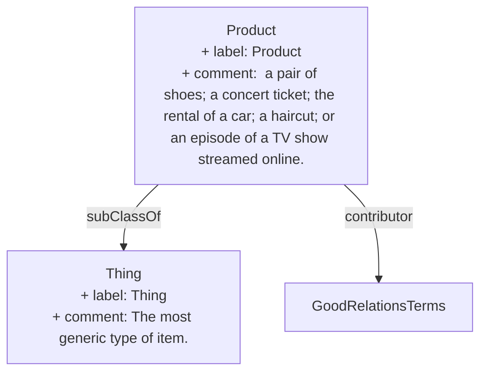

## Related Links

- [[Thing]]

## Semantic Connections

```mermaid
graph TD
  Product["Product<br>+ label: Product<br>+ comment:  a pair of shoes; a concert ticket; the rental of a car; a haircut; or an episode of a TV show streamed online."]:::current-page-node
  Thing["Thing<br>+ label: Thing<br>+ comment: The most generic type of item."]
  GoodRelationsTerms["GoodRelationsTerms"]
  Product-->|" subClassOf "|Thing
  Product-->|" contributor "|GoodRelationsTerms
```
