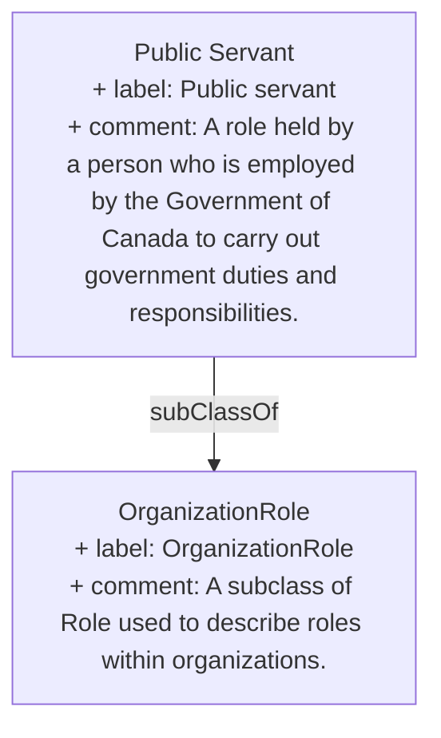

## Related Links

- [[OrganizationRole]]

## Semantic Connections

```mermaid
graph TD
  Public_Servant["Public Servant<br>+ label: Public servant<br>+ comment: A role held by a person who is employed by the Government of Canada to carry out government duties and responsibilities."]:::current-page-node
  OrganizationRole["OrganizationRole<br>+ label: OrganizationRole<br>+ comment: A subclass of Role used to describe roles within organizations."]
  Public_Servant-->|" subClassOf "|OrganizationRole
```
