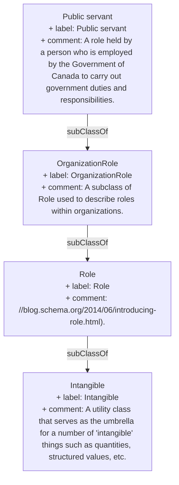

## Related Links

- [[Intangible]]
- [[OrganizationRole]]
- [[Role]]

## Semantic Connections

```mermaid
graph TD
  Public_servant["Public servant<br>+ label: Public servant<br>+ comment: A role held by a person who is employed by the Government of Canada to carry out government duties and responsibilities."]:::current-page-node
  OrganizationRole["OrganizationRole<br>+ label: OrganizationRole<br>+ comment: A subclass of Role used to describe roles within organizations."]
  Role["Role<br>+ label: Role<br>+ comment: //blog.schema.org/2014/06/introducing-role.html)."]
  Intangible["Intangible<br>+ label: Intangible<br>+ comment: A utility class that serves as the umbrella for a number of 'intangible' things such as quantities, structured values, etc."]
  OrganizationRole-->|" subClassOf "|Role
  Public_servant-->|" subClassOf "|OrganizationRole
  Role-->|" subClassOf "|Intangible
```
