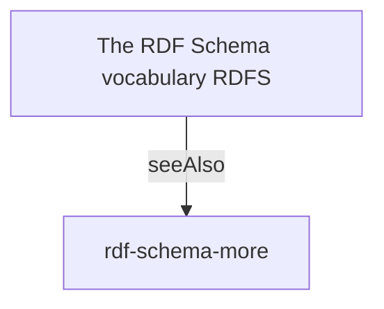

## Semantic Connections

```mermaid
graph TD
  The_RDF_Schema_vocabulary_RDFS["The RDF Schema vocabulary RDFS"]:::current-page-node
  rdf_schema_more["rdf-schema-more"]
  The_RDF_Schema_vocabulary_RDFS-->|" seeAlso "|rdf_schema_more
```
