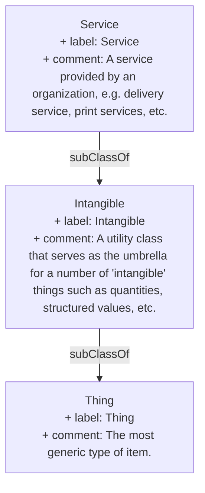

## Related Links

- [[Intangible]]
- [[Thing]]

## Semantic Connections

```mermaid
graph TD
  Service["Service<br>+ label: Service<br>+ comment: A service provided by an organization, e.g. delivery service, print services, etc."]:::current-page-node
  Intangible["Intangible<br>+ label: Intangible<br>+ comment: A utility class that serves as the umbrella for a number of 'intangible' things such as quantities, structured values, etc."]
  Thing["Thing<br>+ label: Thing<br>+ comment: The most generic type of item."]
  Service-->|" subClassOf "|Intangible
  Intangible-->|" subClassOf "|Thing
```
