## Related Links

- [[advances_government_operations_services]]
- [[cyber_security]]
- [[deliver_government_operations_services]]
- [[department_agency_ca]]
- [[government_operations_services]]
- [[information_technology]]
- [[manages_data_information_strategic]]
- [[manages_service_digital_functions]]
- [[operation]]
- [[policy_service_digital]]
- [[product]]
- [[service]]
- [[service_delivery]]
- [[service_digital_functions]]

## Semantic Connections

```mermaid
graph TD
  Service["Service<br>+ label: Service"]:::current-page-node
  Government_operations_and_services["Government operations and services<br>+ label: Government operations and services"]
  Advances_government_operations_and_services["Advances government operations and services<br>+ label: Advances government operations and services"]
  Delivery_government_operations_and_services["Delivery government operations and services<br>+ label: Delivery government operations and services"]
  Product["Product<br>+ label: Product"]
  Operation["Operation<br>+ label: Operation"]
  Service_and_digital_functions["Service and digital functions<br>+ label: Service and digital functions"]
  Policy_on_Service_and_Digital["Policy on Service and Digital<br>+ label: Policy on Service and Digital<br>+ comment: The Policy on Service and Digital defines how a Government Department Agency manages service and digital functions. "]
  Manages_service_and_digital_functions["Manages service and digital functions<br>+ label: Manages service and digital functions"]
  Service_delivery["Service delivery<br>+ label: Service delivery"]
  Information_Technology["Information Technology<br>+ label: Information Technology"]
  Cyber_Security["Cyber Security<br>+ label: Cyber Security"]
  chief_digital_service_officer["chief_digital_service_officer"]
  data_information_functions["data_information_functions"]
  GC_Departments_or_Agencies["GC Departments or Agencies<br>+ label: GC Departments or Agencies"]
  strategic_management_of_data_and_information["strategic management of data and information<br>+ label: strategic management of data and information"]
  Delivery_government_operations_and_services-->|" object "|Government_operations_and_services
  Service-->|" subClassOf "|Government_operations_and_services
  Service_delivery-->|" subClassOf "|Service_and_digital_functions
  Information_Technology-->|" subClassOf "|Service_and_digital_functions
  Advances_government_operations_and_services-->|" object "|Government_operations_and_services
  Product-->|" subClassOf "|Government_operations_and_services
  Operation-->|" subClassOf "|Government_operations_and_services
  Cyber_Security-->|" subClassOf "|Service_and_digital_functions
  chief_digital_service_officer-->|" partOf "|Service_and_digital_functions
  GC_Departments_or_Agencies-->|" performs "|Delivery_government_operations_and_services
  Policy_on_Service_and_Digital-->|" intended_result "|Advances_government_operations_and_services
  strategic_management_of_data_and_information-->|" subClassOf "|Advances_government_operations_and_services
  data_information_functions-->|" subClassOf "|Service_and_digital_functions
  Service_and_digital_functions-->|" subClassOf "|Government_operations_and_services
  Manages_service_and_digital_functions-->|" subClassOf "|Delivery_government_operations_and_services
  Manages_service_and_digital_functions-->|" object "|Service_and_digital_functions
  Policy_on_Service_and_Digital-->|" object "|Service_and_digital_functions
```

