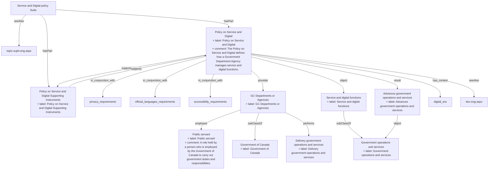

## Related Links

- [[advances_government_operations_services]]
- [[deliver_government_operations_services]]
- [[department_agency_ca]]
- [[government]]
- [[government_operations_services]]
- [[policy_service_digital]]
- [[public_servant]]
- [[service_digital_functions]]
- [[service_digital_supporting_instruments]]

## Semantic Connections

