## Related Links

- [[advances_government_operations_services]]
- [[cyber_security]]
- [[deliver_government_operations_services]]
- [[department_agency_ca]]
- [[government]]
- [[government_operations_services]]
- [[information_technology]]
- [[manages_data_information_strategic]]
- [[manages_service_digital_functions]]
- [[policy]]
- [[policy_service_digital]]
- [[policy_service_digital_8]]
- [[policy_service_digital_8_1]]
- [[policy_service_digital_8_2]]
- [[public_servant]]
- [[service_delivery]]
- [[service_digital_functions]]
- [[service_digital_suite]]

## Semantic Connections

```mermaid
graph TD
  Service_and_Digital_policy_Suite["Service and Digital policy Suite"]:::current-page-node
  topic_sujet_engaspx["topic-sujet-eng.aspx"]
  Policy_on_Service_and_Digital["Policy on Service and Digital<br>+ label: Policy on Service and Digital<br>+ comment: The Policy on Service and Digital defines how a Government Department Agency manages service and digital functions. "]
  Policy_on_Service_and_Digital_Supporting_Instruments["Policy on Service and Digital Supporting Instruments<br>+ label: Policy on Service and Digital Supporting Instruments"]
  policy_suite["policy_suite"]
  privacy_requirements["privacy_requirements"]
  official_languages_requirements["official_languages_requirements"]
  accessibility_requirements["accessibility_requirements"]
  Service_and_digital_functions["Service and digital functions<br>+ label: Service and digital functions"]
  GC_Departments_or_Agencies["GC Departments or Agencies<br>+ label: GC Departments or Agencies"]
  Advances_government_operations_and_services["Advances government operations and services<br>+ label: Advances government operations and services"]
  digital_era["digital_era"]
  doc_engaspx["doc-eng.aspx"]
  Section_8___References___Policy_on_Service_and_Digital["Section 8 - References - Policy on Service and Digital<br>+ label: Section 8 - References - Policy on Service and Digital"]
  Reference_legislations["Reference legislations<br>+ label: Reference legislations"]
  Related_policy_instruments["Related policy instruments<br>+ label: Related policy instruments"]
  Government_operations_and_services["Government operations and services<br>+ label: Government operations and services"]
  Manages_service_and_digital_functions["Manages service and digital functions<br>+ label: Manages service and digital functions"]
  Service_delivery["Service delivery<br>+ label: Service delivery"]
  Information_Technology["Information Technology<br>+ label: Information Technology"]
  Cyber_Security["Cyber Security<br>+ label: Cyber Security"]
  chief_digital_service_officer["chief_digital_service_officer"]
  data_information_functions["data_information_functions"]
  Government_of_Canada["Government of Canada<br>+ label: Government of Canada"]
  Public_servant["Public servant<br>+ label: Public servant<br>+ comment: A role held by a person who is employed by the Government of Canada to carry out government duties and responsibilities."]
  Delivery_government_operations_and_services["Delivery government operations and services<br>+ label: Delivery government operations and services"]
  Public_policy["Public policy<br>+ label: Public policy<br>+ comment: about what governments choose to do, or not do"]
  supporting_instrument["supporting_instrument"]
  supporting_instruments["supporting_instruments"]
  strategic_management_of_data_and_information["strategic management of data and information<br>+ label: strategic management of data and information"]
  policy_suite-->|" hasPart "|supporting_instrument
  Policy_on_Service_and_Digital-->|" in_conjunction_with "|official_languages_requirements
  Policy_on_Service_and_Digital-->|" in_conjunction_with "|privacy_requirements
  Cyber_Security-->|" subClassOf "|Service_and_digital_functions
  strategic_management_of_data_and_information-->|" subClassOf "|Advances_government_operations_and_services
  Service_and_digital_functions-->|" subClassOf "|Government_operations_and_services
  Manages_service_and_digital_functions-->|" object "|Service_and_digital_functions
  Service_and_Digital_policy_Suite-->|" seeAlso "|topic_sujet_engaspx
  supporting_instruments-->|" subClassOf "|policy_suite
  Service_and_Digital_policy_Suite-->|" hasPart "|Policy_on_Service_and_Digital
  Section_8___References___Policy_on_Service_and_Digital-->|" source "|Policy_on_Service_and_Digital
  policy_suite-->|" hasPart "|supporting_instruments
  Information_Technology-->|" subClassOf "|Service_and_digital_functions
  Section_8___References___Policy_on_Service_and_Digital-->|" subClassOf "|Policy_on_Service_and_Digital
  GC_Departments_or_Agencies-->|" employee "|Public_servant
  Service_delivery-->|" subClassOf "|Service_and_digital_functions
  Related_policy_instruments-->|" source "|Section_8___References___Policy_on_Service_and_Digital
  Advances_government_operations_and_services-->|" object "|Government_operations_and_services
  chief_digital_service_officer-->|" partOf "|Service_and_digital_functions
  policy_suite-->|" hasPart "|Public_policy
  Service_and_Digital_policy_Suite-->|" hasPart "|Policy_on_Service_and_Digital_Supporting_Instruments
  GC_Departments_or_Agencies-->|" subClassOf "|Government_of_Canada
  Policy_on_Service_and_Digital-->|" object "|Service_and_digital_functions
  Policy_on_Service_and_Digital-->|" supportedBy "|Policy_on_Service_and_Digital_Supporting_Instruments
  supporting_instrument-->|" subClassOf "|policy_suite
  Policy_on_Service_and_Digital_Supporting_Instruments-->|" supports "|Policy_on_Service_and_Digital
  Policy_on_Service_and_Digital-->|" has_context "|digital_era
  Reference_legislations-->|" source "|Section_8___References___Policy_on_Service_and_Digital
  GC_Departments_or_Agencies-->|" performs "|Delivery_government_operations_and_services
  Policy_on_Service_and_Digital_Supporting_Instruments-->|" subClassOf "|policy_suite
  Policy_on_Service_and_Digital-->|" intended_result "|Advances_government_operations_and_services
  Policy_on_Service_and_Digital-->|" in_conjunction_with "|accessibility_requirements
  Policy_on_Service_and_Digital-->|" seeAlso "|doc_engaspx
  data_information_functions-->|" subClassOf "|Service_and_digital_functions
  Policy_on_Service_and_Digital-->|" provider "|GC_Departments_or_Agencies
```

