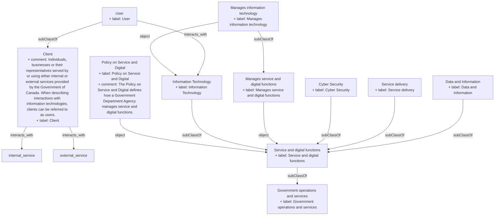

## Related Links

- [[client]]
- [[cyber_security]]
- [[data_information]]
- [[government_operations_services]]
- [[information_technology]]
- [[manages_information_technology]]
- [[manages_service_digital_functions]]
- [[policy_service_digital]]
- [[service_delivery]]
- [[service_digital_functions]]

## Semantic Connections

