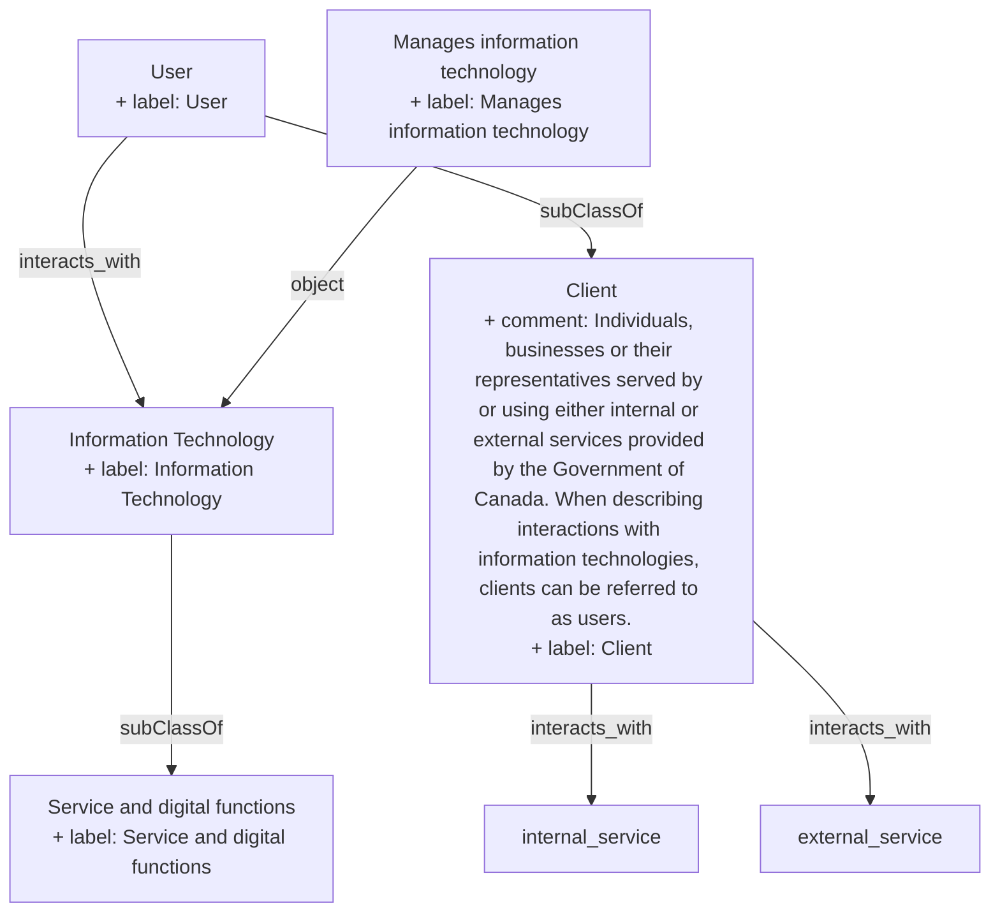

## Related Links

- [[client]]
- [[information_technology]]
- [[manages_information_technology]]
- [[service_digital_functions]]

## Semantic Connections

```mermaid
graph TD
  User["User<br>+ label: User"]:::current-page-node
  Client["Client<br>+ comment: Individuals, businesses or their representatives served by or using either internal or external services provided by the Government of Canada. When describing interactions with information technologies, clients can be referred to as users.<br>+ label: Client"]
  Information_Technology["Information Technology<br>+ label: Information Technology"]
  internal_service["internal_service"]
  external_service["external_service"]
  Service_and_digital_functions["Service and digital functions<br>+ label: Service and digital functions"]
  Manages_information_technology["Manages information technology<br>+ label: Manages information technology"]
  User-->|" interacts_with "|Information_Technology
  Client-->|" interacts_with "|internal_service
  User-->|" subClassOf "|Client
  Information_Technology-->|" subClassOf "|Service_and_digital_functions
  Manages_information_technology-->|" object "|Information_Technology
  Client-->|" interacts_with "|external_service
```
