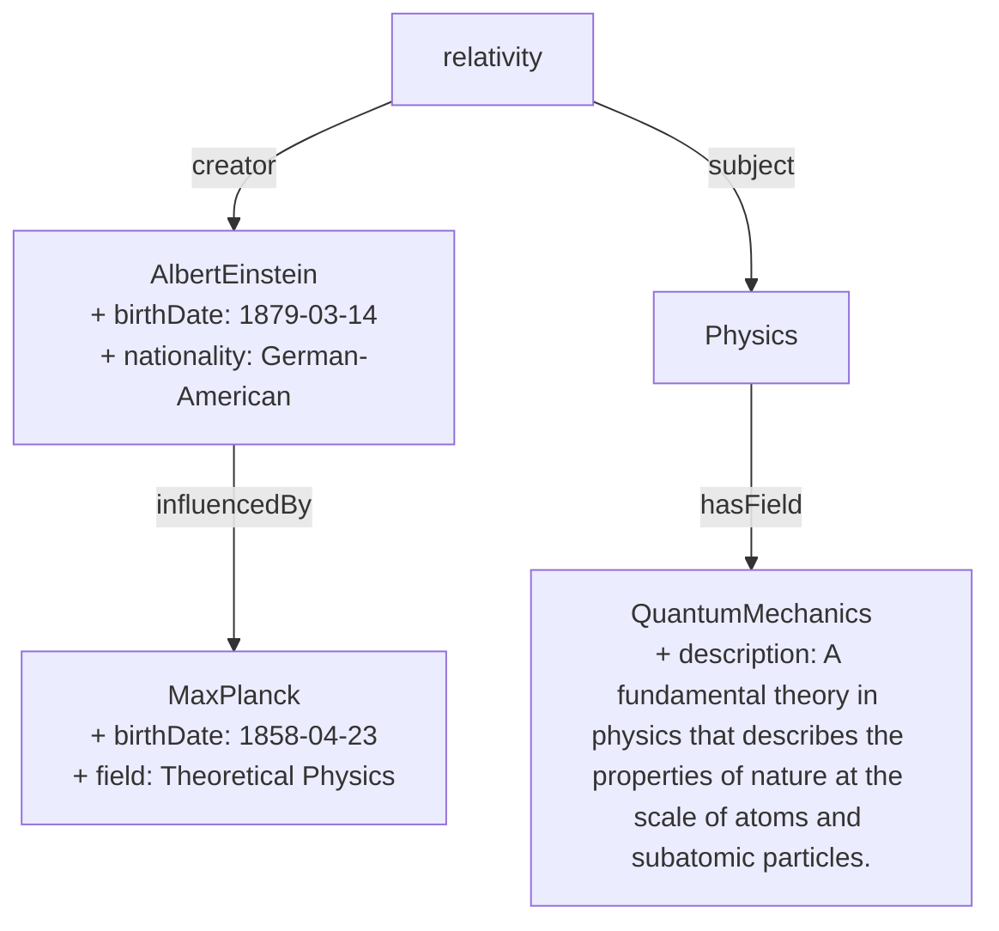

# The Theory of General Relativity

This document discusses Albert Einstein's theory of relativity.

---

### Semantic Connections

```mermaid
graph TD
  relativity["relativity"]
  AlbertEinstein["AlbertEinstein<br>+ birthDate: 1879-03-14<br>+ nationality: German-American"]
  relativity-->|" creator "|AlbertEinstein
  Physics["Physics"]
  relativity-->|" subject "|Physics
  QuantumMechanics["QuantumMechanics<br>+ description: A fundamental theory in physics that describes the properties of nature at the scale of atoms and subatomic particles."]
  Physics-->|" hasField "|QuantumMechanics
  MaxPlanck["MaxPlanck<br>+ birthDate: 1858-04-23<br>+ field: Theoretical Physics"]
  AlbertEinstein-->|" influencedBy "|MaxPlanck
```