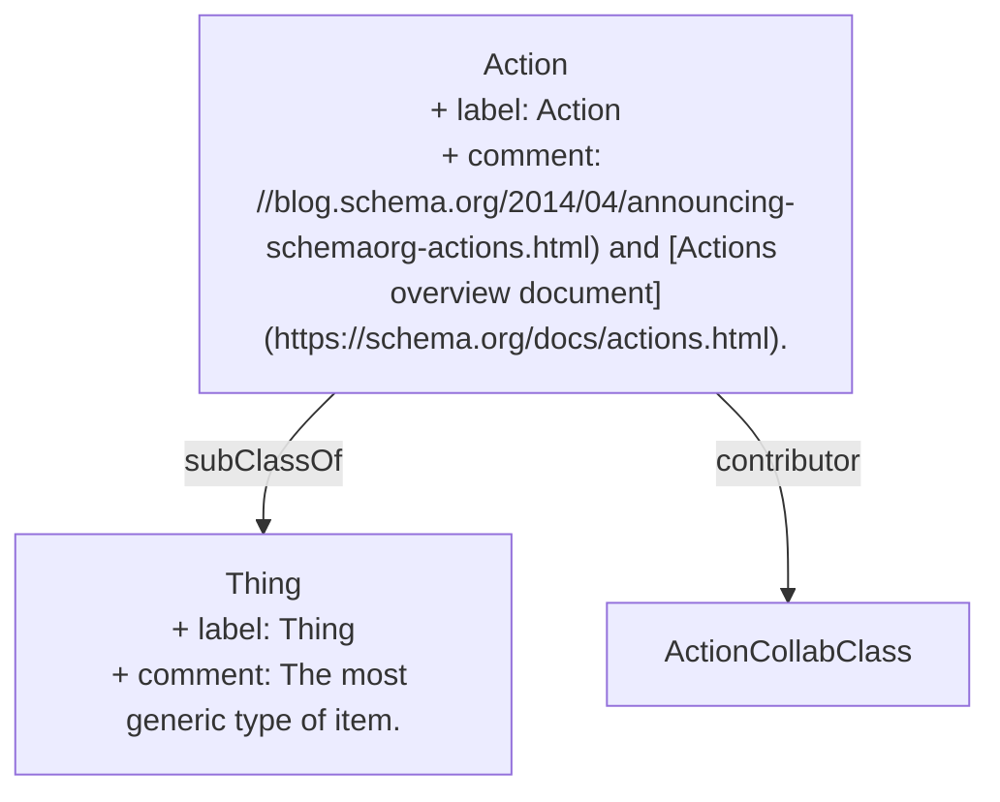

> An action performed by a direct agent and indirect participants upon a direct object. Optionally happens at a location with the help of an inanimate instrument. The execution of the action may produce a result. Specific action sub-type documentation specifies the exact expectation of each argument/role.[^1]

[^1]: [Action - Schema.org Type](https://schema.org/Action)

## Related Links

- [[Thing]]

## Semantic Connections

