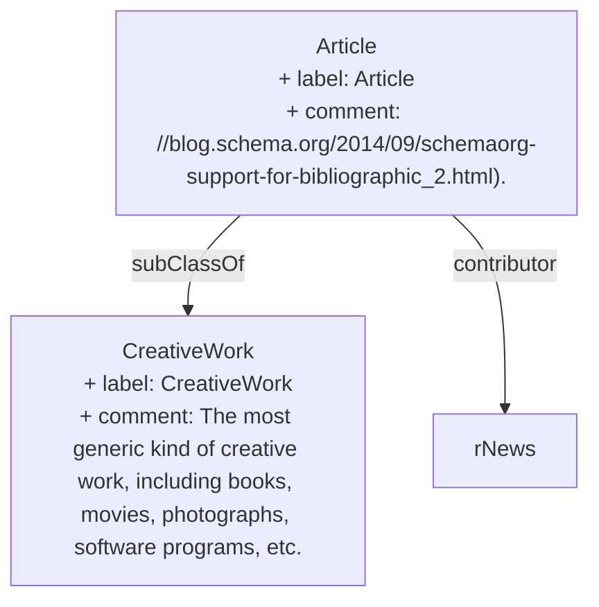

> An article, such as a news article or piece of investigative report. Newspapers and magazines have articles of many different types and this is intended to cover them all.[^1]

[^1]: [Article - Schema.org Type](https://schema.org/Article)

## Related Links

- [[CreativeWork]]

## Semantic Connections

