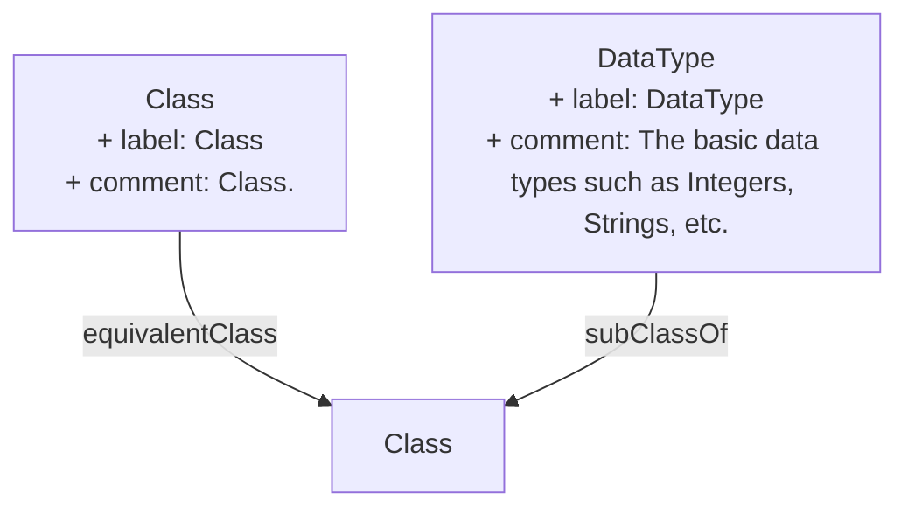

## Semantic Connections

```mermaid
graph TD
  Class["Class"]:::current-page-node
  Class_1["Class<br>+ label: Class<br>+ comment: Class."]
  DataType["DataType<br>+ label: DataType<br>+ comment: The basic data types such as Integers, Strings, etc."]
  Class_1-->|" equivalentClass "|Class
  DataType-->|" subClassOf "|Class
```
