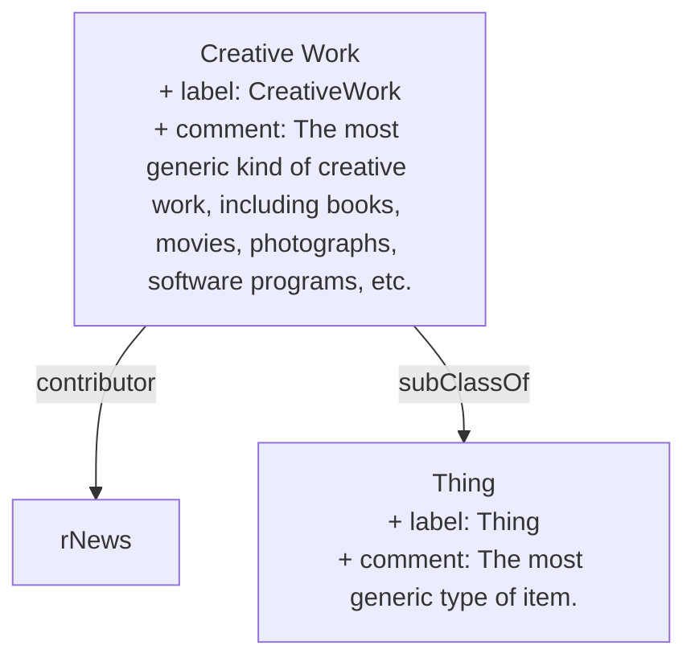

> The most generic kind of creative work, including books, movies, photographs, software programs, etc. [^1]

[^1]: [CreativeWork - Schema.org Type](https://schema.org/CreativeWork)

## Related Links

- [[Thing]]

## Semantic Connections

