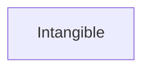

> A utility class that serves as the umbrella for a number of 'intangible' things such as quantities, structured values, etc.[^1]

[^1]: [Intangible - Schema.org Type](https://schema.org/Intangible)

## Related Links

- [[intangible]]

## Semantic Connections

