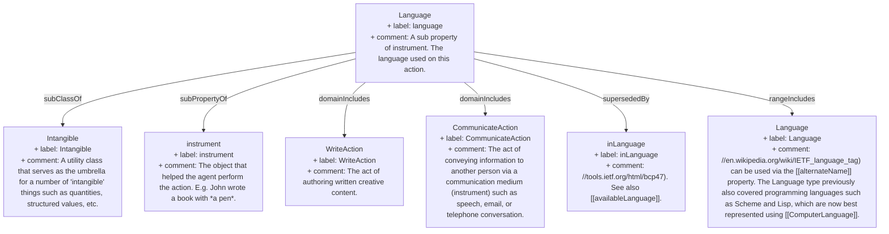

## Related Links

- [[Intangible]]

## Semantic Connections

```mermaid
graph TD
  Language["Language<br>+ label: language<br>+ comment: A sub property of instrument. The language used on this action."]:::current-page-node
  instrument["instrument<br>+ label: instrument<br>+ comment: The object that helped the agent perform the action. E.g. John wrote a book with *a pen*."]
  CommunicateAction["CommunicateAction<br>+ label: CommunicateAction<br>+ comment: The act of conveying information to another person via a communication medium (instrument) such as speech, email, or telephone conversation."]
  WriteAction["WriteAction<br>+ label: WriteAction<br>+ comment: The act of authoring written creative content."]
  Language_1["Language<br>+ label: Language<br>+ comment: //en.wikipedia.org/wiki/IETF_language_tag) can be used via the [[alternateName]] property. The Language type previously also covered programming languages such as Scheme and Lisp, which are now best represented using [[ComputerLanguage]]."]
  inLanguage["inLanguage<br>+ label: inLanguage<br>+ comment: //tools.ietf.org/html/bcp47). See also [[availableLanguage]]."]
  Intangible["Intangible<br>+ label: Intangible<br>+ comment: A utility class that serves as the umbrella for a number of 'intangible' things such as quantities, structured values, etc."]
  Language-->|" subClassOf "|Intangible
  Language-->|" subPropertyOf "|instrument
  Language-->|" domainIncludes "|WriteAction
  Language-->|" domainIncludes "|CommunicateAction
  Language-->|" supersededBy "|inLanguage
  Language-->|" rangeIncludes "|Language_1
```
