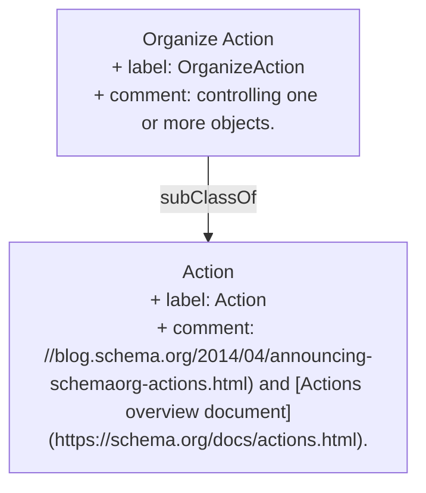

> The act of manipulating/administering/supervising/controlling one or more objects.[^1]

[^1]: [OrganizeAction - Schema.org Type](https://schema.org/OrganizeAction)

## Related Links

- [[Action]]

## Semantic Connections

