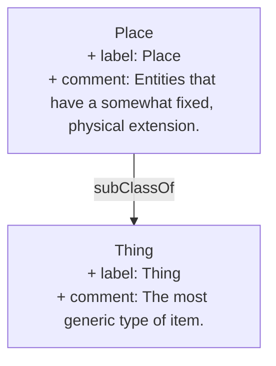

> Entities that have a somewhat fixed, physical extension.[^1]

[^1]: [Place - Schema.org Type](https://schema.org/Place)

## Related Links

- [[Thing]]

## Semantic Connections

```mermaid
graph TD
  Place["Place<br>+ label: Place<br>+ comment: Entities that have a somewhat fixed, physical extension."]:::current-page-node
  Thing["Thing<br>+ label: Thing<br>+ comment: The most generic type of item."]
  Place-->|" subClassOf "|Thing
```
