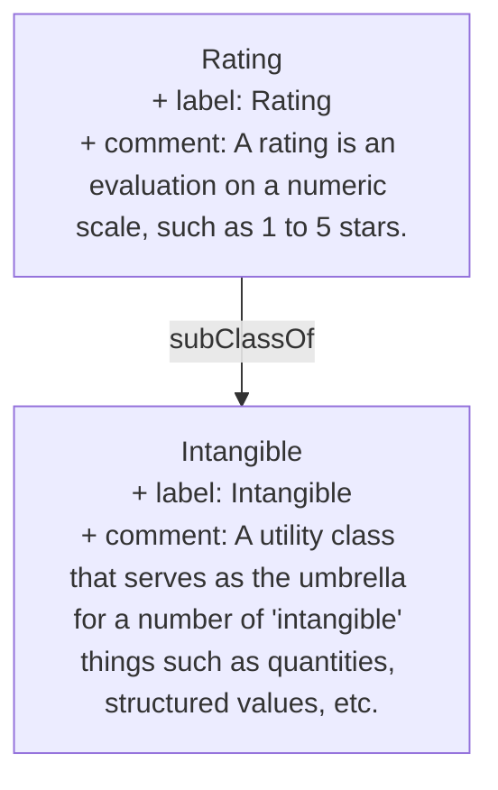

> A rating is an evaluation on a numeric scale, such as 1 to 5 stars.[^1]

[^1]: [Rating - Schema.org Type](https://schema.org/Rating)

## Related Links

- [[Intangible]]

## Semantic Connections

```mermaid
graph TD
  Rating["Rating<br>+ label: Rating<br>+ comment: A rating is an evaluation on a numeric scale, such as 1 to 5 stars."]:::current-page-node
  Intangible["Intangible<br>+ label: Intangible<br>+ comment: A utility class that serves as the umbrella for a number of 'intangible' things such as quantities, structured values, etc."]
  Rating-->|" subClassOf "|Intangible
```
