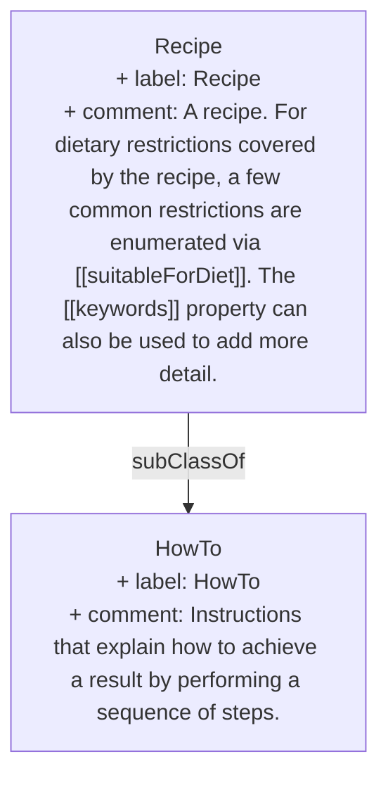

> A recipe. For dietary restrictions covered by the recipe, a few common restrictions are enumerated via [suitableForDiet](https://schema.org/suitableForDiet). The [keywords](https://schema.org/keywords) property can also be used to add more detail.[^1]

[^1]: [Recipe - Schema.org Type](https://schema.org/Recipe)

## Semantic Connections

