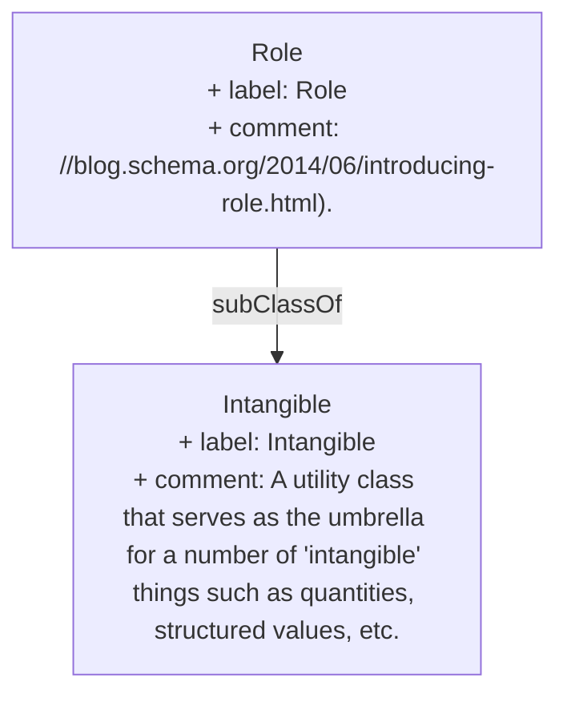

> Represents additional information about a relationship or property. For example a Role can be used to say that a 'member' role linking some SportsTeam to a player occurred during a particular time period. Or that a Person's 'actor' role in a Movie was for some particular characterName. Such properties can be attached to a Role entity, which is then associated with the main entities using ordinary properties like 'member' or 'actor'.[^1]

[^1]: [Role - Schema.org Type](https://schema.org/Role)

## Related Links

- [[Intangible]]

## Semantic Connections

