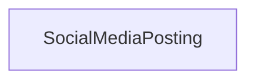

> A post to a social media platform, including blog posts, tweets, Facebook posts, etc.[^1]

[^1]: [SocialMediaPosting - Schema.org Type](https://schema.org/SocialMediaPosting)

## Related Links

- [[socialmediaposting]]

## Semantic Connections

