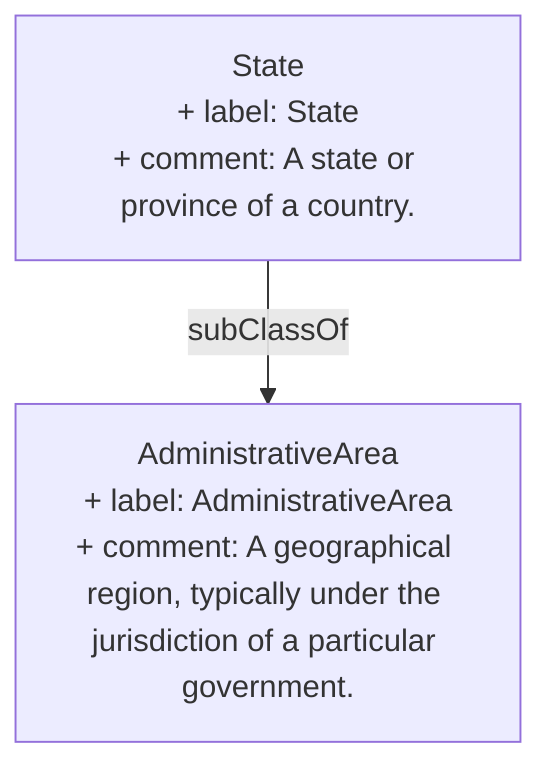

> A state or province of a country.[^1]

[^1]: [State - Schema.org Type](https://schema.org/State)

## Related Links

- [[AdministrativeArea]]

## Semantic Connections

```mermaid
graph TD
  State["State<br>+ label: State<br>+ comment: A state or province of a country."]:::current-page-node
  AdministrativeArea["AdministrativeArea<br>+ label: AdministrativeArea<br>+ comment: A geographical region, typically under the jurisdiction of a particular government."]
  State-->|" subClassOf "|AdministrativeArea
```
