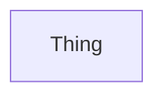

> The most generic type of item.[^1]

[^1]: [Thing - Schema.org Type](https://schema.org/Thing)

## Related Links

- [[thing]]

## Semantic Connections

```mermaid
graph TD
  Thing["Thing"]:::current-page-node
```
