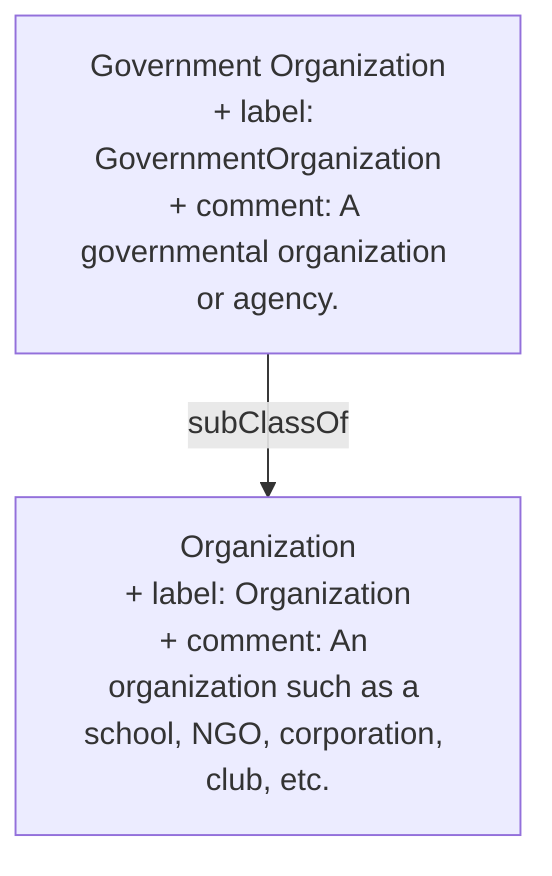

> A governmental organization or agency.[^1]

[^1]: [GovernmentOrganization - Schema.org Type](https://schema.org/GovernmentOrganization)

## Related Links

- [[Organization]]

## Semantic Connections

