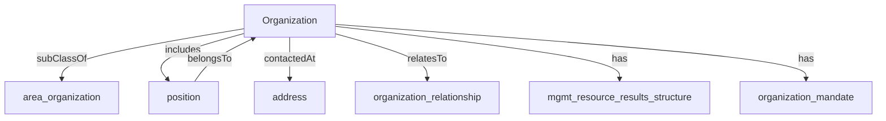

An organization such as a school, NGO, corporation, club, etc.[^1]

[^1]: [Organization - Schema.org Type](https://schema.org/Organization)

## Related Links

- [[address]]
- [[area_organization]]
- [[mgmt_resource_results_structure]]
- [[organization]]
- [[organization_relationship]]
- [[position]]

## Semantic Connections

