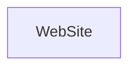

> A WebSite is a set of related web pages and other items typically served from a single web domain and accessible via URLs.[^1]

[^1]: [WebSite - Schema.org Type](https://schema.org/WebSite)

## Related Links

- [[websites]]

## Semantic Connections

