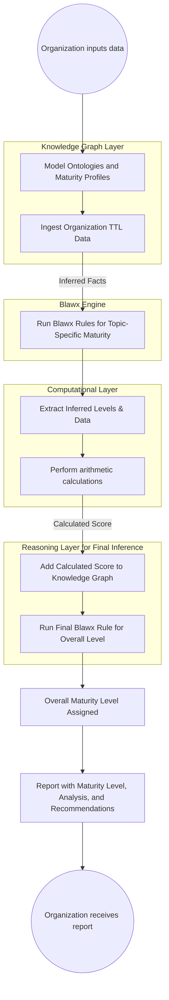

# Dmat Next Steps

```mermaid

flowchart TD
id1((Organization inputs data))

  subgraph s1["Knowledge Graph Layer"]
    n1["Model Ontologies and Maturity Profiles"]
    n2["Ingest Organization TTL Data"]
  end
  subgraph s2["Blawx Engine"]
    n3["Run Blawx Rules for Topic-Specific Maturity"]
  end
  subgraph s3["Computational Layer"]
    n4["Extract Inferred Levels &amp; Data"]
    n5["Perform arithmetic calculations"]
  end
  subgraph s4["Reasoning Layer for Final Inference"]
    n6["Add Calculated Score to Knowledge Graph"]
    n7["Run Final Blawx Rule for Overall Level"]
  end
  n8["Overall Maturity Level Assigned"]
  n9["Report with Maturity Level, Analysis, and Recommendations"]
  n10((Organization receives report))

  id1 ---> n1
  n1 --> n2
  n2 -- Inferred Facts --> n3
  n3 --> n4
  n4 --> n5
  n5 -- Calculated Score --> n6
  n6 --> n7
  n7 --> n8
  n8 --->n9
  n9 --->n10
```
